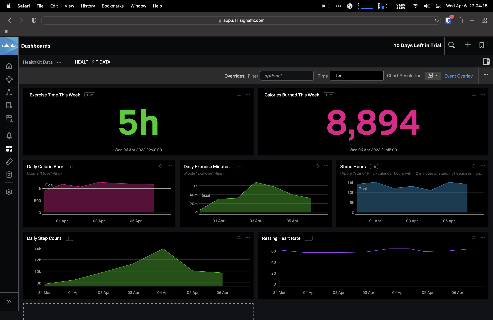

# hksfx
Sample app to pull Apple HealthKit data into SignalFX

## Requirements
- An iPhone with iOS 13 or later (for HealthKit and SwiftUI support)
- A SignalFX account ([free trial](https://www.splunk.com/en_us/download/infrastructure-monitoring.html))
- A device or app (such as Apple Watch, Fitbit, or Whoop) that writes heart rate and exercise data to HealthKit
- Building the app from source requires a paid Apple Developer account. If you don't have one, contact me and I might be able to send you a build via TestFlight.

## Configuration
- Open the app on your iPhone
- Retrieve your Ingest Token from the SignalFX UI and paste it into the app.
- Make sure the proper Realm is selected for your account (see your SFX account settings)
- Hit Save

## Fetching data points
- Open the app on your iPhone
- Hit "Get Data Points"
- Accept the permissions prompt from Apple Health

The first several runs will grab historical data points, and may take awhile. Subsequent runs will only grab new data points.

## Sample dashboard
The dashboard in the above image can be found in json form [here](dashboard_HealthKit%20Data.json). To import it:
- Create a new dashboard group in SignalFX (`+` button on navbar -> `Dashboard Group`)
- While looking at the empty dashboard in your new dashboard group, click the `+` again and then `Import` -> `Dashboard`.
